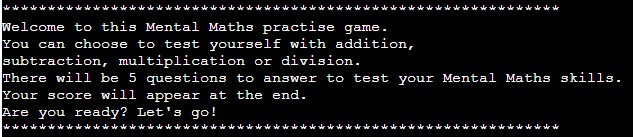
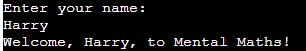
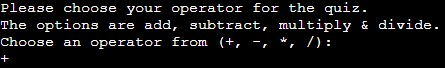
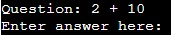
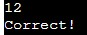
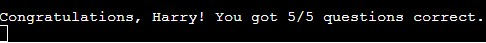
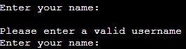
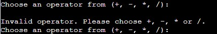
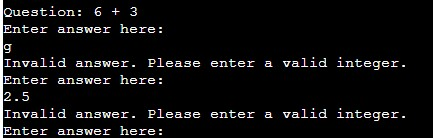

# Maths Quiz - Mental Maths Practise

This is a game aimed at my children to help them practise mental maths. The idea was to give them the choice of which equation they want to practise and provide them with easy and measureable feedback when they're done. 

Visit the site [here](https://mental-maths-b73f6ca716d0.herokuapp.com/)

## Contents

1. [Design](#design)
2. [Features](#features)
3. [UX](#ux)
4. [Testing](#testing)
5. [Sources](#sources)
6. [Credits](#credits)

## Design

*   The information used has been kept brief and concise so the user knows what they're doing in a straight forward manner. 
*   The design was drafted out on paper so I visualise how I wanted this to flow. 

## Features

### Welcome

*   The welcome message gives the user a greeting when the terminal loads and gives a short explanation of what they'll do.

### Name Entry

*   Once the user enters a valid name they are given a personal greeting before they start. 

### Operator Entry

*   The user can choose which operator they'd like to practise with the symbol options being shown to prompt a valid input. 

### Questions

*   After selecting the operator the question is displayed for the user to answer. 

### Answer Entry

*   The user is given feedback to the answer they have entered. This will give them a response of correct or incorrect. 

### End and Results

*   The user is shown a congratulations message at the end of the quiz with their results shown. 

### Input Validation

Each input is checked so it meets the criteria set. 

*   Name input can be anything as it's a username so validation checks and if empty prompts the user to input again. 
*   Operator input is limited to the 4 operands shown and will show the error message if anything else is entered. 
*   Answer input checks for an integer in the answer and will show the error message if anything else is entered. 

### Future Development

I have plans to develop the Mental Maths quiz further with the following features:

*   Loop feature to allow the user to start again when they have finished the questions
*   Random operator choice so it will give a mix of all operators 
*   Question length selection so the user can have more than 5 questions for a longer challenge
*   Personalised end message with a different message depending on how many questions the user answers correctly

## UX

### User

*   Simple and easy to understand when the game loads
*   Direct and useful feedback to any inputs - positive or negative
*   End results displayed so user knows how they did and hope they play again

### Developer

*   Easy to maintain
*   Easy to develop further features using the existing code structure

## Testing

### Browser testing

*   The published page has been tested for layout on chrome, edge, firefox and safari. The appearance is the same for all. 
*   Testing was completed on chrome, edge and firefox for full usage without any problems. 
*   Safari didn't respond to name input on iPhone, iPad or Mac which leads me to think it's a compatibility issue with safari and not the site itself. 

### Validator testing

* Passed the PEP8 Python Linter without any error feedback messages

### Deployment

The repository was created on GitHub and edited in the CodeAnywhere IDE. 

Regular changes and the final submission were submitted to GitHub using the git add, git commit and git push steps. 

The game was deployed to Heroku following the instructions in the Love Sandwiches walkthrough.

## Sources

N/A

## Credits

I used the lessons learnt from the Love Maths walkthrough project to provide the correct equation for the division questions. 

