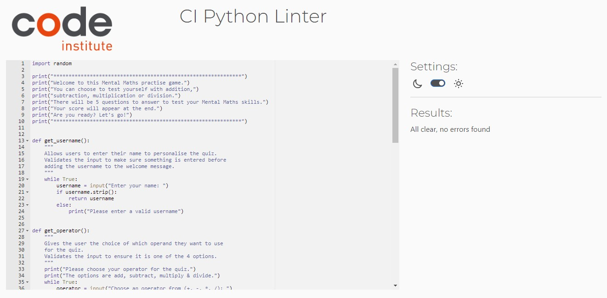

# Maths Quiz - Mental Maths Practise

This is a game aimed at my children to help them practise mental maths. The idea was to give them the choice of which equation they want to practise and provide them with easy and measureable feedback when they're done. 

Visit the site [here](https://mental-maths-b73f6ca716d0.herokuapp.com/)

## Contents

1. [Design](#design)
2. [Features](#features)
3. [UX](#ux)
4. [Testing](#testing)
5. [Sources](#sources)
6. [Credits](#credits)

## Design

*   The information used has been kept brief and concise so the user knows what they're doing in a straight forward manner. 
*   The design was drafted out on paper so I visualise how I wanted this to flow. 

## Features

Welcome

Name Entry

Operator Entry

Questions

Answer Entry

End and Results

Input Validation

Feature Develtopment

## UX

User

Developer

## Testing

### Browser testing

*   The published page has been tested for layout on chrome, edge, firefox and safari. The appearance is the same for all. 
*   Testing was completed on chrome, edge and firefox for full usage without any problems. 
*   Safari didn't respond to name input on iPhone, iPad or Mac which leads me to think it's a compatibility issue with safari and not the site itself. 

### Validator testing

* Passed the PEP8 Python Linter without any error feedback messages

### Deployment

The repository was created on GitHub and edited in the CodeAnywhere IDE. 

Regular changes and the final submission were submitted to GitHub using the git add, git commit and git push steps. 

The game was deployed to Heroku following the instructions in the Love Sandwiches walkthrough.

## Sources

N/A

## Credits

I used the lessons learnt from the Love Maths walkthrough project to provide the correct equation for the division questions. 

